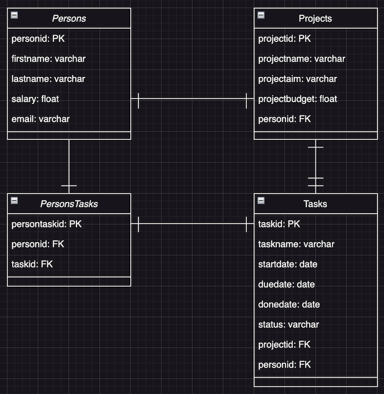

# A Website to explore Data Science projects

Hi :wave:, and welcome to the Data Science Website build on Streamlit.

## Description
Application is built with *Python*, hosted on *Streamlit Community Cloud* and it's data are
stored in *PostgreSQL*, hosted on _Supabase_.

## Pages
These are sources of main pages of a respected app:

| File Name             | Description                                                            | Link                                    |
|-----------------------|------------------------------------------------------------------------|-----------------------------------------|
| Data_Explorer.py      | Explores Data Sets red from .csv files provided by user                | [LINK](./pages/1_Data_Explorer.py)      |
| Project_Management.py | Executes project management tasks, reads and writes data to database   | [LINK](./pages/2_Project_management.py) |
| Various_Elements.py   | Explores different built in Streamlit possibilities to use in web app  | [LINK](./pages/4_Various_Elements.py)   |

## Installing Streamlit

_You can use the [requirements.txt](requirements.txt) file (red by command `pip freeze > .\requirements.txt`) to install all the required libraries,
or if you already have pandas and numpy, you can just install streamlit by opening
a command prompt / terminal and typing in:_

`pip install -r .\requirements.txt` 
or 
`pip install streamlit`

## Running Streamlit

_Once Streamlit has been installed you can run the select file by typing the following in the command prompt/terminal:_

`streamlit run app.py`

## Data Sources
_For testing purposes the initial data set may be used:_

| File Name       | Source                                | Source Link                   |
|-----------------|---------------------------------------|-------------------------------|
| movies.csv      | Some Demo Data for Data Explorer      | [LINK](./data/movies.csv)     |
| initial_data.py | Some Demo Data for Project Management | [LINK](./src/initial_data.py) |
## DataBase Diagram
_DataBase Diagram was used to construct the database structure_

 
### 🧪 Running tests

_There are tests writen for connection testing in [test directory](./data/test_conn.py). You can run it in console by command:_

`pytest`

## 🎅 Authors

Audrius: [Github](https://github.com/audrbar)

## ⚠️ License

Distributed under the MIT License. See LICENSE.txt for more information.

## 🔗 Other resources

Langchain PDF App: [Langchain](https://www.youtube.com/watch?v=wUAUdEw5oxM)
