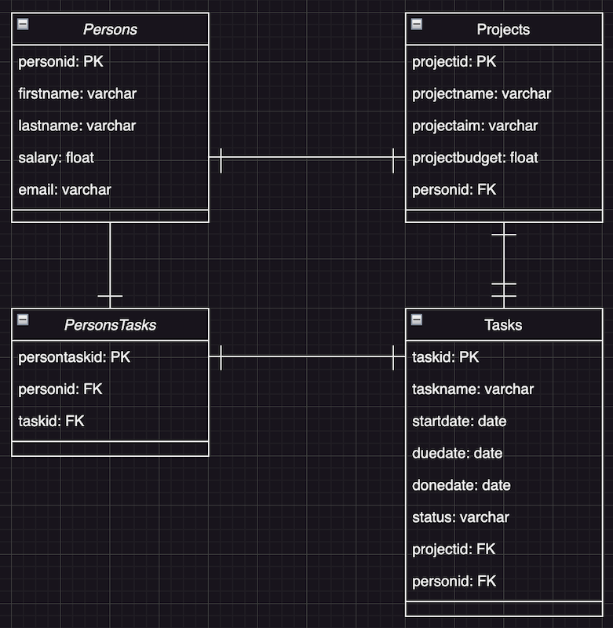

# Data Science Multi-Page Application

Hi :wave:, and welcome to the Data Science Website built with Streamlit.

## Description

Application is built with **Python**, hosted on **Streamlit Community Cloud** and its data is stored in **PostgreSQL**, hosted on _Supabase_. The project uses modern **UV package manager** for fast dependency management.

## Features

-   📊 Interactive data exploration from CSV files
-   🗂️ PostgreSQL-based project management system
-   💰 Mortgage calculator with visualization
-   🎨 Demonstration of various Streamlit UI elements
-   🤖 AI-powered PDF question answering with LangChain & OpenAI

## Pages

These are the main pages of the application:

| File Name             | Description                                                          | Link                                    |
| --------------------- | -------------------------------------------------------------------- | --------------------------------------- |
| Data_Explorer.py      | Explores datasets read from .csv files provided by user              | [LINK](./pages/1_Data_Explorer.py)      |
| Project_Management.py | Executes project management tasks, reads and writes data to database | [LINK](./pages/2_Project_management.py) |
| mortgage_calc.py      | Interactive mortgage calculator with payment schedule visualization  | [LINK](./pages/3_mortgage_calc.py)      |
| Various_Elements.py   | Explores different built-in Streamlit UI possibilities               | [LINK](./pages/4_Various_Elements.py)   |
| Langchain_PDF.py      | AI assistant that answers questions about uploaded PDF documents     | [LINK](./pages/5_Langchain_PDF.py)      |

## Installation

### Prerequisites

-   Python 3.12 or higher
-   UV package manager (recommended) or pip

### Using UV (Recommended)

UV is a fast Python package manager. Install it first:

```bash
# On macOS/Linux
curl -LsSf https://astral.sh/uv/install.sh | sh

# On Windows
powershell -c "irm https://astral.sh/uv/install.ps1 | iex"
```

Then set up the project:

```bash
# Clone the repository
git clone <your-repo-url>
cd py_site

# Create virtual environment
uv venv

# Activate virtual environment
source .venv/bin/activate  # On macOS/Linux
.venv\Scripts\activate     # On Windows

# Install dependencies
uv pip install -e .
```

### Using pip (Alternative)

```bash
# Install dependencies from requirements.txt
pip install -r requirements.txt
```

## Configuration

### Database Setup

Create a `.streamlit/secrets.toml` file with your database credentials:

```toml
[connections.postgresql]
dialect = "postgresql"
host = "your-host.supabase.com"
port = "5432"
database = "postgres"
username = "your-username"
password = "your-password"

[openai]
api_key = "your-openai-api-key"
```

## Running the Application

```bash
# Make sure virtual environment is activated
streamlit run Home.py
```

The application will open in your default browser at `http://localhost:8501`

## Project Structure

```
py_site/
├── Home.py                 # Main entry point
├── pages/                  # Multi-page application pages
├── src/                    # Database connection and table classes
├── data/                   # Sample data and diagrams
├── style/                  # Custom CSS
├── images/                 # Static images
├── tests/                  # Test files
├── pyproject.toml          # UV/pip dependencies
├── requirements.txt        # Pip requirements (legacy)
└── README.md              # This file
```

## Data Sources

For testing purposes, the following initial data sets are available:

| File Name       | Source                           | Source Link                   |
| --------------- | -------------------------------- | ----------------------------- |
| movies.csv      | Demo Data for Data Explorer      | [LINK](./data/movies.csv)     |
| initial_data.py | Demo Data for Project Management | [LINK](./src/initial_data.py) |

## Database Diagram

Database diagram used to construct the database structure:



## Technology Stack

-   **Framework**: Streamlit 1.37+
-   **Language**: Python 3.12+
-   **Package Manager**: UV
-   **Database**: PostgreSQL (Supabase)
-   **ORM**: SQLAlchemy 2.0+
-   **AI/ML**: LangChain, OpenAI, FAISS
-   **Data Processing**: Pandas, NumPy
-   **Visualization**: Matplotlib, Seaborn

## Dependencies

Core dependencies are managed in `pyproject.toml`:

-   streamlit, pandas, numpy (core)
-   psycopg2-binary, SQLAlchemy (database)
-   langchain, openai, faiss-cpu (AI/ML)
-   matplotlib, seaborn (visualization)

See [pyproject.toml](./pyproject.toml) for complete list.

## 🧪 Running Tests

Tests are available in the [tests directory](./tests/). Run them with pytest:

```bash
pytest
```

## 🎅 Authors

Audrius: [Github](https://github.com/audrbar)

## ⚠️ License

Distributed under the MIT License. See [LICENSE](./LICENSE) for more information.

## 🔗 Resources

-   [Streamlit Documentation](https://docs.streamlit.io/)
-   [LangChain Documentation](https://python.langchain.com/)
-   [UV Package Manager](https://github.com/astral-sh/uv)
-   [Langchain PDF Tutorial](https://www.youtube.com/watch?v=wUAUdEw5oxM)
